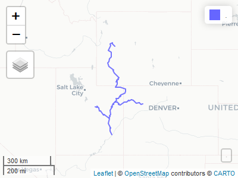

<!-- README.md is generated from README.Rmd. Please edit that file -->

# UCRBSpatialTools

<!-- badges: start -->
<!-- badges: end -->

The goal of UCRBSpatialTools is to provide wrappers with convenient
defaults around [sf](https://r-spatial.github.io/sf/) and links to Upper
Colorado River Basin spatial data sets. This spatial data is based on
that available from the [STReaMS](https://streamsystem.org/index.php)
website under *Help & Documentation &gt; Resources &gt; UCRB River
Miles*

## Installation

You can install the development version of UCRBSpatialTools from
[GitHub](https://github.com/) with:

``` r
# install.packages("devtools")
devtools::install_github("cmichaud92/UCRBSpatialTools")
```

## Usage

Researchers occasionally benefit from interactive exploration of spatial
data. This package facilitates the process of converting coordinate
strings or river miles to spatial locations to allow for rapid mapping.
Some of the functions return maps, others return an sf dataframe.

## Examples

### get\_pts

Fetch an sf dataframe containing river mile points on the green river
between mile 120 and 97:

``` r
library(UCRBSpatialTools)
get_pts(.where = "cd_rvr = 'GR'
        AND rmi_nhd BETWEEN 120.5 AND 121")  |>  
  knitr::kable()
#> Reading query `SELECT * FROM nhd_rmi_pts WHERE cd_rvr = 'GR'
#>         AND rmi_nhd BETWEEN 120.5 AND 121' from data source `C:\Users\cmichaud\OneDrive - DOI\Documents\R\win-library\4.1\UCRBSpatialTools\extdata\ucrb_spat.sqlite' 
#>   using driver `SQLite'
#> Simple feature collection with 6 features and 6 fields
#> Geometry type: POINT
#> Dimension:     XY
#> Bounding box:  xmin: -110.15 ymin: 38.97824 xmax: -110.1484 ymax: 38.98484
#> CRS:           NA
```

| id\_rvr\_streams | rmi\_nhd | nm\_rvr     | cd\_rvr | nm\_rch           | cd\_rch | GEOMETRY                   |
|-----------------:|---------:|:------------|:--------|:------------------|:--------|:---------------------------|
|                4 |    121.0 | Green River | GR      | Lower Green River | LGR     | POINT (-110.1498 38.98484) |
|                4 |    120.9 | Green River | GR      | Lower Green River | LGR     | POINT (-110.1496 38.9834)  |
|                4 |    120.8 | Green River | GR      | Lower Green River | LGR     | POINT (-110.1488 38.98215) |
|                4 |    120.7 | Green River | GR      | Lower Green River | LGR     | POINT (-110.1484 38.98074) |
|                4 |    120.6 | Green River | GR      | Lower Green River | LGR     | POINT (-110.1493 38.97958) |
|                4 |    120.5 | Green River | GR      | Lower Green River | LGR     | POINT (-110.15 38.97824)   |

This is useful in situations where you would like to visualize encounter
locations provided in *river and river miles* on a map.

### get\_lns

Fetch a linestring sf dataframe for the Green, Price and White rivers
and map it

``` r
get_lns(.where = "cd_rvr IN ('GR', 'PR', 'WH')") %>% 
  mapview()
#> Reading query `SELECT * FROM nhd_ctr_lns WHERE cd_rvr IN ('GR', 'PR', 'WH')' from data source `C:\Users\cmichaud\OneDrive - DOI\Documents\R\win-library\4.1\UCRBSpatialTools\extdata\ucrb_spat.sqlite' 
#>   using driver `SQLite'
#> Simple feature collection with 3 features and 3 fields
#> Geometry type: LINESTRING
#> Dimension:     XY
#> Bounding box:  xmin: -111.1389 ymin: 38.18782 xmax: -107.6394 ymax: 43.36801
#> Geodetic CRS:  WGS 84
```


